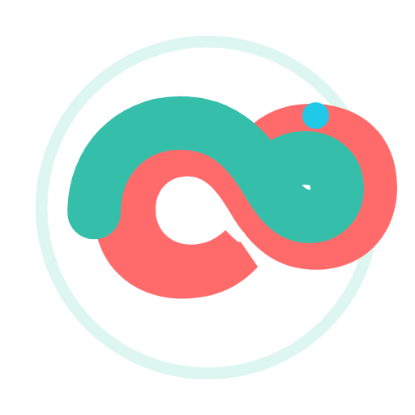
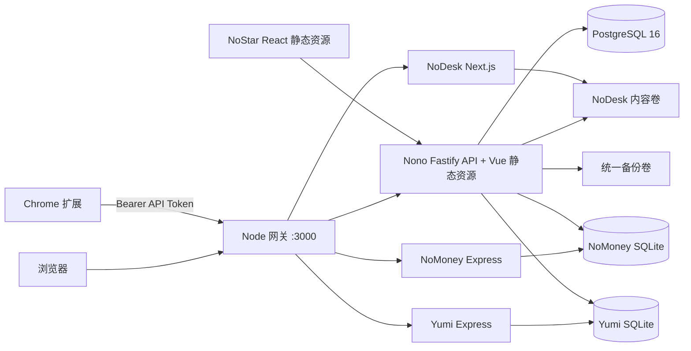

# Nono

<p align="center">
  <strong>简体中文</strong> | <a href="README_EN.md">English</a>
</p>

<p align="center">
  
</p>

<p align="center">
  一个可自托管的个人数字工作台：统一管理网址导航、内容发布、个人资产、基础设施和 GitHub Stars。
</p>

<p align="center">
  <a href="https://github.com/noaul/nono">GitHub</a> ·
  <a href="https://github.com/noaul/nono/issues">问题反馈</a> ·
  <a href="https://noaul.com/privacy">隐私政策</a>
</p>

Nono 不是单一页面应用，而是一套放在同一仓库、同一域名和同一部署链路中的个人服务集合。核心 Nono 提供公开导航、管理后台、认证和公共 API；NoDesk、NoMoney、Yumi、NoStar 与 Chrome 扩展分别承担内容、资产、基础设施、GitHub 收藏和浏览器书签采集工作。

> 本项目面向个人或小规模可信用户的自托管场景。默认生产形态是一个业务容器加一个 PostgreSQL 容器，不是多节点高可用架构。

## 目录

- [项目组成](#项目组成)
- [功能概览](#功能概览)
- [系统架构](#系统架构)
- [技术栈](#技术栈)
- [仓库结构](#仓库结构)
- [快速开始](#快速开始)
- [首次初始化](#首次初始化)
- [本地开发](#本地开发)
- [环境变量](#环境变量)
- [数据与存储](#数据与存储)
- [认证与权限](#认证与权限)
- [AI 集成](#ai-集成)
- [测试与质量门禁](#测试与质量门禁)
- [生产部署](#生产部署)
- [备份与恢复](#备份与恢复)
- [数据迁移](#数据迁移)
- [Chrome 扩展](#chrome-扩展)
- [第三方依赖](#第三方依赖)
- [安全与隐私](#安全与隐私)
- [常见问题](#常见问题)
- [维护约定](#维护约定)
- [文档索引](#文档索引)
- [项目链接与许可](#项目链接与许可)
- [社区](#社区)

## 项目组成

| 产品 | 默认路径 | 主要用途 | 认证 | 主要存储 |
| --- | --- | --- | --- | --- |
| **Nono** | `/`、`/:username`、`/admin/*` | 公开网址导航、书签与文件夹管理、站点配置、用户和系统管理 | Nono Session / Passkey / API Token | PostgreSQL |
| **NoDesk** | `/nodesk/*` | 文章、图片、项目、友链、片段、日程和个人内容站 | 公开读取；写入复用 Nono 管理员 Session | `nodesk_content` 文件卷 |
| **NoMoney** | `/nomoney/*` | 电话卡、订阅、账号、支出和到期提醒 | 独立 HttpOnly Cookie Session | `nomoney_data/app.db` |
| **Yumi** | `/yumi/*` | VPS、域名、续费、费用和运行状态 | 独立 HttpOnly Cookie Session | `yumi_data/app.db` |
| **NoStar** | `/nostar/*` | GitHub Stars、分类、搜索、Release、AI 分析与备份 | 复用 Nono Session | PostgreSQL |
| **Chrome 扩展** | 浏览器弹窗/右键菜单/快捷键 | 提取当前网页并快速保存到 Nono | 专用 Bearer API Token | `chrome.storage.local` |

生产环境由 `docker/gateway.mjs` 统一监听外部端口。它负责路径分发和业务子进程生命周期；任一关键子进程退出时，业务容器会退出并交由 Docker Compose 重启。

## 功能概览

### Nono

- 为每个用户提供公开导航页，支持自定义站点信息、搜索引擎、主题、背景和展示设置。
- 以树形文件夹组织书签，支持排序、移动、批量操作、重复项识别、导入导出和回收站。
- 支持站点访客访问开关、站点密码以及单独的文件夹密码。
- 自动获取网页标题、描述和图标；定时检查链接健康状态，并可更新最终重定向地址。
- 提供 Notab、通知中心、用户管理、外观设置、自动化、审计日志和备份管理页面。
- 支持密码登录、Passkey、设备 Session 管理，以及带作用域和过期时间的 API Token。
- 通过 OpenAI 或 Claude 兼容接口分析网页，生成书签名称、描述和文件夹建议。
- 提供中英文界面和桌面/移动端响应式布局。

### NoDesk

- 提供首页工作台、文章列表与详情、关于页、项目、图片、友链、博主、片段等内容页面。
- 支持 Markdown、代码高亮、KaTeX、目录、RSS、Sitemap 和站点元数据。
- 提供写作、图片上传、站点配置和首页布局编辑能力。
- 编辑操作通过同源 Nono 管理员 Session 鉴权，浏览器中不保存单独的写入密钥。
- 内容、图片、站点配置和日程保存在独立文件卷，部署新镜像不会覆盖已有内容。

### NoMoney

- 管理电话卡、订阅和账号信息。
- 记录实际支出，按币种统计预计月度/年度成本和年度实际费用。
- 展示资产数量、到期项目、费用趋势和提醒状态。
- 支持 CNY、USD、GBP、EUR；不同币种分别展示，不自动进行汇率换算。
- 支持每日到期扫描、SMTP 邮件提醒、回收站和加密 JSON 备份。
- 使用独立账号、Session、加密密钥和 SQLite 数据库，不与 Nono 账号自动互通。

### Yumi

- 管理 VPS 与域名，包括服务商、地区、规格、账期、到期日和续费记录。
- 将续费记录与实际费用关联，并向 Nono 通知中心提供临期提醒。
- 定时采集 VPS 状态，展示在线情况、资源容量和历史状态。
- 支持基础设施凭据加密、私网出站主机白名单和加密 JSON 备份。
- 与 NoMoney 共用代码和组件，但使用独立进程、账号、Cookie、密钥和 SQLite 文件。

### NoStar

- NoStar 基于 [AmintaCCCP/GithubStarsManager](https://github.com/AmintaCCCP/GithubStarsManager) 集成与演进。
- 同步并管理 GitHub Stars，支持分类、自定义标签、描述、排序和批量操作。
- 提供本地搜索、筛选、README 查看、相似项目和发现视图。
- 跟踪仓库 Release、未读状态和下载资源。
- 支持 OpenAI/Claude 兼容 AI 配置、仓库分析、自动分类和向量检索配置。
- 支持 GitHub、AI、WebDAV、网络代理、aria2 RPC 和诊断日志设置。
- 数据按 Nono 用户隔离；GitHub Token、AI Key、WebDAV 密码等敏感配置由服务端加密保存。

### Chrome 扩展

- 仅在用户主动操作时读取当前标签页的标题、URL、描述和正文摘要。
- 支持 AI 分析后确认保存、手动选择文件夹、快速保存到上次文件夹。
- 发现相同 URL 时可以更新已有书签，避免无提示地重复创建。
- 提供工具栏弹窗、右键菜单和 `Alt+Shift+S` / `Alt+Shift+B` 快捷键。
- 服务端访问权限按用户配置的精确 Origin 动态申请，不使用常驻内容脚本。
- 弹窗采用 HyperOS 风格的雾面玻璃视觉，并内置版本、GitHub、Issue 和隐私政策入口。

## 系统架构



### 请求路由

| 外部路径 | 目标服务 | 说明 |
| --- | --- | --- |
| `/`、`/:username` | Nono | 默认/指定用户的公开导航页 |
| `/login`、`/setup`、`/admin/*` | Nono | 登录、首次初始化和管理后台 |
| `/api/*` | Nono | Nono API；`/api/nostar/*` 也由 Nono 提供 |
| `/nodesk`、`/nodesk/*` | NoDesk | 内容站与编辑界面 |
| `/blog/*` | NoDesk | 兼容入口，308 重定向到 `/nodesk/*` |
| `/nomoney`、`/nomoney/*` | NoMoney | 个人资产费用工作台 |
| `/yumi`、`/yumi/*` | Yumi | 服务器与域名工作台 |
| `/nostar`、`/nostar/*` | Nono / NoStar | Nono 提供 NoStar 静态资源和同源 API |
| `/healthz`、`/livez` | Nono | 进程存活检查 |
| `/readyz` | Nono | PostgreSQL、NoDesk、NoMoney、Yumi 联合就绪检查 |

`GATEWAY_TRUST_FORWARDED_HEADERS` 默认关闭。启用时还必须通过 `GATEWAY_TRUSTED_PROXY_ADDRESSES` 配置允许提交转发头的代理 IP 或 CIDR；未命中的连接仍按直连请求处理。

## 技术栈

| 层 | 技术 |
| --- | --- |
| Nono API | Node.js 22、TypeScript、Fastify 5、Prisma 6、PostgreSQL 16、Zod |
| Nono Web | Vue 3、Vite 7、Pinia、Vue Router、SortableJS、Lucide |
| NoDesk | Next.js 16、React 19、Markdown/Unified、KaTeX、Shiki、Zustand |
| NoMoney / Yumi | Express 4、React 18、Vite 6、sql.js/SQLite、Recharts、JWT Cookie |
| NoStar | React 18、Vite 8、Zustand、Tailwind CSS |
| Chrome 扩展 | Manifest V3、原生 JavaScript、Chrome Extension APIs |
| 测试 | Vitest、Node Test Runner、Playwright、契约测试 |
| 部署 | 多阶段 Dockerfile、Docker Compose、Node HTTP 网关 |

仓库根 npm workspaces 只包含 `packages/server`、`packages/web`、`packages/extension`。`apps/blog`、`apps/nomoney`、`apps/nostar` 保留各自的依赖与锁文件。

## 仓库结构

```text
nono/
├─ packages/
│  ├─ server/          # Nono/NoStar API、Prisma、认证、备份与后台任务
│  ├─ web/             # Nono Vue 前端
│  └─ extension/       # Chrome 扩展、商店素材和发布文档
├─ apps/
│  ├─ blog/            # NoDesk Next.js 内容站
│  ├─ nomoney/         # NoMoney/Yumi 共用的 Express + React 源码
│  ├─ nostar/          # NoStar React 前端
├─ docker/             # 单端口网关、路径和代理头规则
├─ scripts/            # 部署、验收、回滚、备份、恢复和迁移脚本
├─ tests/              # 跨模块、Docker、网关和部署契约测试
├─ docs/
│  ├─ deployment/      # 生产部署、备份恢复、迁移和审计手册
│  ├─ design/          # 跨产品 UI 契约与主题说明
│  └─ quality/         # UI/性能验收基线
├─ design/             # 品牌图标与设计资源
├─ Dockerfile
├─ docker-compose.yml
├─ .env.example
└─ package.json        # 全仓库统一命令入口
```

## 快速开始

### 方式一：Docker Compose 完整启动

这是体验完整产品和验证集成行为的推荐方式。

```bash
git clone https://github.com/noaul/nono.git
cd nono
cp .env.example .env
```

Windows PowerShell 可使用 `Copy-Item .env.example .env`。编辑 `.env`，至少替换所有 `replace-with-*` 示例值，并确认以下项目：

- `POSTGRES_PASSWORD`：数据库密码。
- `SESSION_SECRET`：至少 32 个字符的随机值。
- `ENCRYPTION_KEY`：64 位十六进制随机值。
- `NOMONEY_JWT_SECRET`、`YUMI_JWT_SECRET`：两份互不相同的随机长密钥。
- `NOMONEY_INTERNAL_TOKEN`：Nono 与 Yumi 内部接口使用的独立随机 Token。
- `NOMONEY_ENCRYPTION_KEY`、`YUMI_ENCRYPTION_KEY`：建议使用两份互不相同的 64 位十六进制密钥。
- `NONO_PUBLIC_URL`、`BLOG_PUBLIC_URL`：浏览器实际访问的完整地址。

如果只在本机通过 HTTP 试用，将 `NONO_PUBLIC_URL` 设为 `http://localhost:3000`，并把 `NOMONEY_COOKIE_SECURE`、`YUMI_COOKIE_SECURE` 临时设为 `false`。生产环境必须恢复为 `true` 并使用 HTTPS。

```bash
docker compose up -d --build
docker compose ps
curl --fail http://127.0.0.1:3000/healthz
curl --fail http://127.0.0.1:3000/readyz
```

默认入口：

| 页面 | 地址 |
| --- | --- |
| Nono | `http://localhost:3000/` |
| Nono 管理后台 | `http://localhost:3000/admin/` |
| NoDesk | `http://localhost:3000/nodesk/` |
| NoMoney | `http://localhost:3000/nomoney/` |
| Yumi | `http://localhost:3000/yumi/` |
| NoStar | `http://localhost:3000/nostar/` |

停止容器时使用 `docker compose down`。普通停止或升级不要附加 `-v`，否则会删除数据库和内容卷。

### 方式二：只开发 Nono

```bash
npm run install:all
cp .env.example .env
docker compose up -d postgres
npm run prisma:generate
npm run prisma:migrate
```

分别启动 API 和前端：

```bash
npm run dev
npm run dev:web
```

- API：`http://127.0.0.1:3000`
- Vite 前端：`http://127.0.0.1:5173`
- Vite 会把 `/api` 代理到 `VITE_API_TARGET`，默认是 `http://127.0.0.1:3000`。

## 首次初始化

### Nono

首次访问 Nono 时，前端会跳转到 `/setup`。填写 `.env` 中统一的 `BOOTSTRAP_TOKEN` 后才能创建第一个管理员；服务端使用 PostgreSQL 事务锁和 `AppConfig.initializedAt` 防止并发请求重复初始化。

初始化完成后：

1. 在“账户设置”中确认邮箱、密码和 Passkey。
2. 在“站点设置”中配置公开导航页。
3. 创建文件夹和书签，或从浏览器书签文件导入。
4. 需要扩展时，在“API Token”中创建专用、可过期 Token。
5. 需要 AI 时，在“LLM 设置”中添加服务商、模型和密钥并测试连接。

`ALLOW_REGISTRATION=false` 时不允许后续自助注册。管理员可以在后台修改注册开关和用户角色；即使旧数据库的默认角色配置为管理员，自助注册也只会创建普通用户。

### NoMoney 与 Yumi

NoMoney 和 Yumi 都有自己的 `/setup`，需要使用同一个 `BOOTSTRAP_TOKEN` 分别创建账号。它们不复用 Nono Session，也不彼此复用 Cookie；注销会立即撤销当前 JWT 会话，重放旧 Cookie 无法恢复登录。生产部署中 Yumi 首次创建独立数据库时，会等待 NoMoney 数据库初始化并迁移旧版 VPS/域名相关数据；之后两套数据独立写入。

### NoDesk 与 NoStar

NoDesk 的公开内容无需登录；编辑内容需要 Nono 管理员 Session。NoStar 直接复用 Nono Session，未登录访问时跳转到带原目标路径的 Nono 登录页。

## 本地开发

### 依赖安装

环境要求：

- Node.js `>=22`
- npm `>=10`
- pnpm `11.8.0`，由 `apps/blog/packageManager` 锁定
- PostgreSQL 16
- Docker Engine 和 Docker Compose v2，仅容器开发、部署或验收时需要

```bash
corepack enable
npm run install:all
```

`install:all` 会严格使用四套锁文件：根 npm、NoDesk pnpm、NoMoney npm、NoStar npm npm。不要用另一个包管理器重写这些锁文件。

### 开发命令

| 目标 | 命令 | 说明 |
| --- | --- | --- |
| Nono API | `npm run dev` | Fastify watch 模式，默认端口 3000 |
| Nono Web | `npm run dev:web` | Vite，默认端口 5173 |
| NoDesk | `npm run dev:blog` | Next.js Turbopack，端口 2025 |
| NoMoney 后端 | `npm run dev:nomoney` | 共用后端的 NoMoney 模式，默认端口 3000 |
| NoStar 前端 | `npm run dev:nostar` | Vite 前端开发服务器 |
| 全部生产构建 | `npm run build:all` | 构建所有产品和扩展 |

这些独立开发服务器存在默认端口冲突，不应无配置地一次全部启动。跨产品登录、同源路由、NoDesk 写入和 NoStar API 联调优先使用 Docker Compose；只修改单个界面时再运行对应开发服务器。

NoMoney/Yumi 前端共享源码，构建时会生成两套静态资源：

```bash
npm run build:nomoney
```

- `apps/nomoney/backend/public/`：NoMoney
- `apps/nomoney/backend/public-yumi/`：Yumi

### 数据库开发

```bash
npm run prisma:generate   # 生成 Prisma Client
npm run prisma:migrate    # 创建/应用开发迁移
npm run prisma:deploy     # 仅应用已有迁移，适合部署
npm run seed              # 显式写入演示数据
```

`npm run seed` 不是首次初始化的一部分，且需要显式提供 `SEED_ADMIN_PASSWORD`。不要在共享或生产数据库中随意运行种子脚本。

## 环境变量

以 [`.env.example`](.env.example) 为配置起点。`.env` 不进入 Git；生产密钥应由密码管理器、容器 Secret 或受控部署系统提供。

`docker-compose.yml` 只会把 `app.environment` 中显式映射的变量传入业务容器。直接启动 Nono 服务时可用、但 Compose 未映射的变量（例如 `CORS_ORIGIN` 和 `LOG_LEVEL`）如需在容器中覆盖，必须同时加入 Compose 的 `app.environment`。

### PostgreSQL 与 Nono

| 变量 | 默认/要求 | 用途 |
| --- | --- | --- |
| `POSTGRES_DB` | `nono` | Compose 创建的数据库名 |
| `POSTGRES_USER` | `nono` | Compose 数据库角色 |
| `POSTGRES_PASSWORD` | **生产必填** | PostgreSQL 密码 |
| `POSTGRES_BIND_ADDRESS` | `127.0.0.1` | 主机端数据库监听地址 |
| `POSTGRES_PORT` | `5433` | 主机端数据库端口 |
| `DATABASE_URL` | 本地必填；Compose 自动生成 | Prisma PostgreSQL 连接串 |
| `SESSION_SECRET` | **生产必填，至少 32 字符** | Nono Session 签名密钥 |
| `ENCRYPTION_KEY` | **生产必填，64 位十六进制** | 加密 LLM、GitHub、WebDAV 等服务端凭据 |
| `ALLOW_REGISTRATION` | `false` | 首次创建配置时的自助注册开关 |
| `CORS_ORIGIN` | 空 | 额外允许的网页 Origin，逗号分隔 |
| `LOG_LEVEL` | `info` | Nono 服务日志级别 |

### 地址、网关与 WebAuthn

| 变量 | 默认/要求 | 用途 |
| --- | --- | --- |
| `PORT` | `127.0.0.1:3000` | Compose 应用端口映射 |
| `BOOTSTRAP_TOKEN` | **生产必填** | Nono、NoMoney、Yumi 首次初始化共同使用的一次性部署凭据 |
| `NONO_PUBLIC_URL` | **生产必填** | 浏览器实际访问的根地址和同源校验依据 |
| `BLOG_PUBLIC_URL` | **生产必填** | NoDesk 完整公开地址，通常是 `<root>/nodesk` |
| `NONO_NAVIGATION_URL` | `/` | NoDesk 返回 Nono 的导航地址 |
| `BLOG_NAVIGATION_URL` | `/nodesk` | Nono 进入 NoDesk 的导航地址 |
| `WEBAUTHN_RP_NAME` | `Nono` | Passkey 显示名称 |
| `WEBAUTHN_RP_ID` | 从公开 URL 推导 | Passkey RP ID；特殊域名场景覆盖 |
| `WEBAUTHN_ORIGIN` | 从公开 URL 推导 | Passkey 允许的精确 Origin |
| `GATEWAY_TRUST_FORWARDED_HEADERS` | `false` | 是否信任网关入口收到的转发头 |
| `GATEWAY_TRUSTED_PROXY_ADDRESSES` | 空 | 启用转发头信任时允许的代理 IP/CIDR，逗号分隔 |
| `GATEWAY_UPSTREAM_TIMEOUT_MS` | `30000` | 网关等待内部应用响应的最长毫秒数；超时返回 `504` |
| `NONO_BUILD_COMMIT` | `unknown` | 写入备份清单的构建标识 |
| `TZ` | `Asia/Shanghai` | 日程、提醒和自动备份时区 |

### 出站访问与后台任务

| 变量 | 默认值 | 用途 |
| --- | --- | --- |
| `PRIVATE_OUTBOUND_HOSTS` | 空 | 允许服务端访问的精确私网主机白名单 |
| `LINK_HEALTH_CHECK_ENABLED` | `true` | 是否启用自动链接检查 |
| `LINK_HEALTH_CHECK_INTERVAL_HOURS` | `24` | 链接健康结果过期时间 |
| `LINK_HEALTH_CHECK_START_DELAY_SECONDS` | `60` | 链接检查调度器启动延迟 |
| `BACKUP_AUTOMATION_POLL_SECONDS` | `60` | 自动备份计划轮询间隔，最小 10 秒 |
| `BACKUP_AUTOMATION_START_DELAY_SECONDS` | `60` | 自动备份调度器启动延迟 |

`PRIVATE_OUTBOUND_HOSTS` 会放宽 SSRF 防护，只应填写精确、可控的主机名或 IP，不要配置宽泛网段。

### NoMoney 与 Yumi

| 变量 | 默认/要求 | 用途 |
| --- | --- | --- |
| `NOMONEY_JWT_SECRET` | **生产必填** | NoMoney 独立 Session 密钥 |
| `YUMI_JWT_SECRET` | **生产必填** | Yumi 独立 Session 密钥 |
| `NOMONEY_INTERNAL_TOKEN` | **生产必填** | Nono/Yumi 内部续费接口认证 |
| `NOMONEY_ENCRYPTION_KEY` | 默认回退到 `ENCRYPTION_KEY` | NoMoney 敏感字段加密；生产建议独立 64 位十六进制值 |
| `YUMI_ENCRYPTION_KEY` | **Compose 必填** | Yumi 敏感字段加密，64 位十六进制值 |
| `NOMONEY_COOKIE_SECURE` | `true` | NoMoney Cookie 是否仅通过 HTTPS 发送 |
| `YUMI_COOKIE_SECURE` | `true` | Yumi Cookie 是否仅通过 HTTPS 发送 |
| `NOMONEY_SMTP_HOST` | 空 | 提醒邮件 SMTP 主机 |
| `NOMONEY_SMTP_PORT` | `587` | SMTP 端口 |
| `NOMONEY_SMTP_USER` | 空 | SMTP 用户名 |
| `NOMONEY_SMTP_PASS` | 空 | SMTP 密码 |
| `NOMONEY_SMTP_FROM` | 空 | 发件地址 |
| `NOMONEY_SMTP_TO` | 空 | 默认收件地址 |

密钥轮换前必须确认依赖关系。更换 `ENCRYPTION_KEY`、`NOMONEY_ENCRYPTION_KEY` 或 `YUMI_ENCRYPTION_KEY` 会导致原有加密字段无法解密；更换 `SESSION_SECRET` 或 JWT Secret 会使现有会话失效。仅修改 `.env` 中的 `POSTGRES_PASSWORD` 不会更新已有 PostgreSQL 卷内的角色密码，需要在数据库中同步轮换。

## 数据与存储

### Compose 命名卷

| 卷 | 内容 | 主要读写者 |
| --- | --- | --- |
| `nono_pg_data` | Nono、NoStar、用户、Session、Passkey、审计和配置 | PostgreSQL |
| `nodesk_content` | NoDesk 文章、图片、站点配置和日程 | Nono + NoDesk |
| `nomoney_data` | NoMoney `app.db` | NoMoney；Nono 只读到期信息 |
| `yumi_data` | Yumi `app.db`、VPS 状态和续费数据 | Yumi；Nono 读取通知并调用受保护内部接口 |
| `nono_backups` | 全站 `.tar.gz` 归档和 `.json` 清单 | Nono/运维脚本 |

PostgreSQL 中的核心模型包括用户、站点、文件夹、链接、回收站、API Token、设备 Session、Passkey、通知状态、备份自动化、审计日志，以及按用户隔离的 NoStar 仓库、Release、分类和集成配置。

NoMoney 与 Yumi 使用 `sql.js` 持久化 SQLite 文件。每个产品只允许一个业务进程写入自己的数据库；不要让多个容器或多个副本共享同一个 SQLite 卷。

### 数据生命周期

- 删除文件夹或书签时先进入 Nono 回收站，之后可恢复或永久删除。
- Nono Session 和 API Token 只在数据库中保存哈希；明文 Token 仅在创建时返回一次。
- 集成凭据使用应用加密密钥加密后保存，备份时仍属于敏感数据。
- NoDesk 首次启动会从镜像种子内容初始化空卷；已初始化的内容卷不会被新镜像覆盖。
- 统一备份不包含 `.env`、TLS 证书和反向代理配置，必须单独加密备份。

## 认证与权限

| 场景 | 认证方式 | 权限边界 |
| --- | --- | --- |
| Nono 浏览器 | `nono_session` HttpOnly Cookie | 用户资源隔离；管理员可管理系统级配置和用户 |
| Passkey | WebAuthn | 绑定 HTTPS Origin 和 RP ID，用于 Nono 登录 |
| Chrome 扩展/自动化 | `Authorization: Bearer <token>` | 按 Token scope 和过期时间限制 |
| NoDesk 编辑 | Nono 管理员 Session | 公开读取，管理员写入内容卷 |
| NoStar | Nono Session | PostgreSQL 数据按 Nono 用户隔离 |
| NoMoney | 独立 HttpOnly JWT Cookie | 仅访问 NoMoney SQLite 数据 |
| Yumi | 独立 HttpOnly JWT Cookie | 仅访问 Yumi SQLite 数据 |
| Nono ↔ Yumi 内部调用 | `NOMONEY_INTERNAL_TOKEN` | 只用于受保护的内部续费操作 |

API Token 支持以下作用域：

| Scope | 能力 |
| --- | --- |
| `bookmarks:read` | 读取文件夹和书签 |
| `bookmarks:write` | 新建、更新、移动和删除书签 |
| `ai:analyze` | 调用网页分析接口 |
| `*` | 完整 API Token 权限，应谨慎使用 |

插件默认获得书签读取、书签写入和 AI 分析三个作用域。剪藏已退役，升级迁移会移除历史剪藏数据与权限。为每台设备创建单独 Token，设置合理的过期时间；设备丢失或停用扩展时立即撤销。

### Passkey 注意事项

Passkey 只能在 HTTPS 或浏览器认可的 `localhost` 安全上下文中工作。`WEBAUTHN_RP_ID` 与注册时的域名绑定，修改域名或 RP ID 后原凭据将无法继续使用。部署变更前应保留可恢复的密码登录，并在新域名上重新注册 Passkey。

## AI 集成

Nono 支持两类请求格式：

- OpenAI 兼容：默认基址 `https://api.openai.com/v1`，调用 `chat/completions`。
- Claude 兼容：默认基址 `https://api.anthropic.com/v1`，调用 `messages`。

可在 Nono 后台为当前用户配置 Provider、Base URL、API Key、模型和推理强度。NoStar 还支持多个 AI Profile、Embedding 配置和外部向量搜索服务。

网页收藏分析会把 URL、页面标题、截断后的正文摘要和当前文件夹规则发送给配置的模型。未配置模型或模型调用失败时，Nono 会使用本地回退逻辑生成名称、描述和默认文件夹，不阻塞基本收藏功能。

所有 LLM 和集成请求都经过服务端安全出站请求层：

- DNS 解析后阻止回环、私网、链路本地和云 metadata 地址。
- 每次重定向重新校验目标地址。
- 设置请求超时和响应大小上限。
- 只有管理员可通过 `PRIVATE_OUTBOUND_HOSTS` 访问显式允许的私网目标。

自定义兼容服务如果位于内网，必须精确加入白名单；这会扩大服务端可访问范围，应在网络层同步限制。

## 测试与质量门禁

提交前的完整验证入口：

```bash
npm run verify:all
```

它依次执行：

1. Nono Server、Web、扩展、NoDesk、NoMoney、NoStar 和网关/部署契约测试。
2. NoDesk 与 NoStar 类型检查，以及 NoStar ESLint。
3. 所有产品的生产构建。
4. Playwright 端到端测试。
5. NoStar bundle 预算检查。
6. 四套依赖树的高危漏洞审计。
7. Chrome 扩展发布包生成与内容校验。

按范围运行：

```bash
npm test                       # Nono server、web、extension
npm run test:blog              # NoDesk
npm run test:nomoney           # NoMoney / Yumi
npm run test:nostar            # NoStar
npm run test:gateway           # 网关、Docker、部署、备份与恢复契约
npm run test:e2e               # Playwright 端到端测试
npm run build:all              # 全部构建
npm run audit:all              # 全部依赖审计
npm run package:extension      # 构建并打包 Chrome 扩展
```

首次运行 Playwright 前：

```bash
npm run test:e2e:install
```

GitHub Actions 在 pull request 和 `main` 推送时执行远端质量门禁。生产发布仍由服务器本地的 Compose 部署脚本完成，不由 CI 自动改写生产环境。

## 生产部署

### Compose 部署

1. 准备一台安装 Docker Engine、Docker Compose v2 和 Git 的 Linux 主机。
2. 将仓库放在受控目录，例如 `/opt/nono`。
3. 从 `.env.example` 创建 `.env`，填入独立随机密钥和真实 HTTPS 地址。
4. 只把应用端口绑定到回环地址，让反向代理负责公网 TLS。

```bash
cd /opt/nono
docker compose up -d --build
docker compose ps
curl --fail http://127.0.0.1:3000/readyz
```

Compose 启动顺序是 PostgreSQL 健康后启动业务容器。业务容器会先初始化卷权限、执行 `prisma migrate deploy`，再启动网关及 Nono、NoDesk、NoMoney、Yumi 子进程。

### 验收式更新与回滚

推荐通过仓库脚本生成带 Git 提交号的不可变镜像，并在切换后自动验收：

```bash
cd /opt/nono
flock -n /var/lock/nono-deploy.lock node scripts/deploy-compose.mjs --dir /opt/nono --base-url http://127.0.0.1:8188
```

只验收当前部署：

```bash
npm run deploy:accept -- --base-url http://127.0.0.1:8188
```

指定已有镜像回滚：

```bash
flock -n /var/lock/nono-deploy.lock npm run deploy:rollback -- \
  --dir /opt/nono \
  --base-url http://127.0.0.1:8188 \
  --image nono-app:<git-commit>
```

部署脚本依据实际数据库的待执行迁移检查破坏性变更；确认后需显式传入 `--allow-destructive-migrations`。先构建镜像，再停止全部应用写入，用旧的不可变镜像创建并验证完整安全备份，保存至 `/app/backups/deployment-safety`，不参与日常保留清理。新版本在隔离端口和正常端口分别通过维护模式验收后才开放访问。开放前失败会恢复安全备份和旧镜像；开放结果不确定时不会覆盖已验收的数据。详见[部署手册](docs/deployment/compose-verified-deploy.md)。

单独的 `deploy:rollback` 只切换镜像，不会还原数据库或数据卷；不可用它独自回退不兼容的数据库迁移。部署、恢复和仅镜像回滚操作必须使用同一 `flock -n /var/lock/nono-deploy.lock` 锁串行执行；锁被占用时会立即失败。

### 反向代理与 TLS

Nono 自身不签发公网证书。建议用 Caddy、Nginx 或同等级反向代理终止 TLS，并将请求转发到回环地址：

```nginx
server {
    listen 443 ssl;
    server_name example.com;

    location / {
        proxy_pass http://127.0.0.1:3000;
        proxy_http_version 1.1;
        proxy_set_header Host $host;
        proxy_set_header X-Real-IP $remote_addr;
        proxy_set_header X-Forwarded-For $proxy_add_x_forwarded_for;
        proxy_set_header X-Forwarded-Proto https;
    }
}
```

同时设置：

```text
NONO_PUBLIC_URL=https://example.com
BLOG_PUBLIC_URL=https://example.com/nodesk
NOMONEY_COOKIE_SECURE=true
YUMI_COOKIE_SECURE=true
```

不要把 PostgreSQL 端口或未加密应用端口直接暴露到公网。只有确认反向代理是唯一入口并正确清洗转发头后，才设置 `GATEWAY_TRUST_FORWARDED_HEADERS=true`，并同步填写 `GATEWAY_TRUSTED_PROXY_ADDRESSES`。携带 Authorization、Cookie、API Key 或 URL Token 的公网出站请求必须使用 HTTPS；HTTP 只允许 loopback 或 `PRIVATE_OUTBOUND_HOSTS` 中明确列出的私网服务。

## 备份与恢复

统一备份覆盖 PostgreSQL、NoDesk 文件、NoMoney SQLite 和 Yumi SQLite。每次备份生成一个 `.tar.gz` 归档和同名 `.json` 清单，包含来源构建、文件大小和各组件 SHA-256。

```bash
npm run backup:create
npm run backup:list
npm run backup:verify -- --id <backup-id>
npm run backup:drill -- --id <backup-id>
```

`backup:drill` 会在临时 PostgreSQL 数据库和临时目录中执行完整恢复演练，不修改生产数据。至少应定期执行一次演练，而不只是确认归档文件存在。

恢复会覆盖生产数据，必须显式重复确认备份 ID：

```bash
flock -n /var/lock/nono-deploy.lock npm run backup:restore -- \
  --id <backup-id> \
  --confirm <backup-id>
```

恢复器会先深度校验归档和数据库完整性，再停止业务写入、创建并验证安全快照、恢复四个组件、在维护模式中启动原镜像并验收；开放访问前失败时恢复安全快照。恢复剪藏退役前的数据必须配合匹配的旧镜像，否则新版本启动时会再次执行退役迁移。

NoDesk 设置中心的当前账户模块备份与恢复使用后台任务：立即接受请求，持久化任务状态，支持断线后查询。全站数据卷恢复仍需使用服务器命令。历史兼容接口 `POST /api/admin/backups` 仍同步响应，不是新界面的提交入口。

重要边界：

- 备份归档本身没有额外加密，包含密码哈希、业务数据和加密后的集成凭据。
- `nono_backups` 与生产卷在同一主机时不能覆盖整机或磁盘故障。
- 应将归档复制到受控的异机或对象存储，并对传输和静态文件加密。
- 跨服务器恢复必须保留原 `ENCRYPTION_KEY`、`NOMONEY_ENCRYPTION_KEY` 和 `YUMI_ENCRYPTION_KEY`。
- `.env`、TLS 证书和反向代理配置不在统一归档中，需要单独备份。

完整操作顺序见 [全站备份与恢复](docs/deployment/full-backup-restore.md)。

## 数据迁移

### Prisma

开发环境创建并应用迁移：

```bash
npm run prisma:migrate
```

生产只应用仓库已有迁移：

```bash
npm run prisma:deploy
```

`initializedAt` 迁移会回填既有管理员初始化状态，因此部署脚本的数据重写门禁会要求首次上线时显式确认 `--allow-destructive-migrations`。完成该迁移后，没有新的受控数据迁移时不需要长期保留此参数。

### 旧版 Nono JSON

```bash
npm run migrate:json -- data/nono.json
```

运行前必须通过受控的进程环境提供 `MIGRATED_ADMIN_PASSWORD`。迁移脚本不会接受隐式默认密码；也不要把真实密码写入命令历史、日志或仓库文件。

### 旧版 NoStar SQLite

先演练，再正式导入指定 Nono 用户：

```bash
npm run migrate:nostar -- --sqlite /path/to/data.db --username admin --dry-run
npm run migrate:nostar -- --sqlite /path/to/data.db --username admin
```

脚本可读取 SQLite 同目录的 `.encryption-key`，也支持 `--source-key <64-hex>`。正式迁移前会创建时间戳备份，并使用幂等 upsert 写入 PostgreSQL。

### NoMoney 与 Yumi

旧版 NoMoney 生产数据切换和 NoMoney/Yumi 拆分涉及 SQLite 文件、加密密钥与回滚窗口，必须按专项手册执行：

- [NoMoney 生产迁移](docs/deployment/nomoney-production-migration.md)
- [Yumi 数据拆分](docs/deployment/yumi-split-migration.md)

所有迁移都应遵循：先备份、校验备份、在副本上演练、记录回滚点、最后切换生产。

## Chrome 扩展

扩展位于 `packages/extension`，当前版本为 **0.4.3**。

### 开发安装

```bash
npm ci
npm run build -w packages/extension
```

然后打开 `chrome://extensions/`：

1. 开启“开发者模式”。
2. 点击“加载已解压的扩展程序”。
3. 选择 `packages/extension/dist/`。
4. 在 Nono 后台创建专用 API Token。
5. 在扩展中填写 Nono HTTPS 地址和 Token，测试连接后选择默认文件夹。

公网服务地址必须使用 HTTPS；HTTP 仅允许 `localhost`、`127.0.0.1` 和 `::1` 本地开发地址。

### 权限说明

| 权限 | 用途 |
| --- | --- |
| `activeTab` | 在用户主动点击时读取当前标签页 |
| `scripting` | 按需执行页面元数据提取脚本 |
| `storage` | 保存服务器地址、Token、语言和上次文件夹 |
| `contextMenus` | 提供右键快速收藏入口 |
| 可选 Host 权限 | 仅访问用户配置的精确 Nono Origin |

扩展不注册常驻内容脚本，不持续监控浏览历史，也不把数据发送给 Nono 地址之外的服务。AI 分析由用户配置的 Nono 服务端完成；是否进一步发送给第三方模型取决于该 Nono 账号的 LLM 配置。

### 打包发布

```bash
npm run package:extension
```

输出：

```text
packages/extension/dist/
packages/extension/artifacts/nono-quick-bookmark-chrome-v0.4.3/
packages/extension/artifacts/nono-quick-bookmark-chrome-v0.4.3.zip
```

发布前必须同步更新 `packages/extension/package.json` 与 `manifest.json` 版本，运行扩展测试和打包，检查 ZIP 中不含 `.env`、源码映射、测试、临时文件或个人数据，再使用 `store-assets/` 中的图标和宣传素材提交 Chrome Web Store。

详细说明：

- [扩展使用与权限说明](packages/extension/README.md)
- [Chrome Web Store 提交清单与文案](packages/extension/CHROME_WEB_STORE.md)
- [商店素材说明](packages/extension/store-assets/README.md)

## 第三方依赖

第三方声明见 [THIRD_PARTY_NOTICES.md](THIRD_PARTY_NOTICES.md)。该文件不为本仓库指定项目级开源许可证；仓库目前仍未附带根级 `LICENSE`，即保留所有权利。

## 安全与隐私

### 已实现的安全边界

- 密码执行强度校验并使用慢哈希；Session 和 API Token 只持久化哈希。
- Session Cookie 使用 `HttpOnly`、`SameSite=Lax`，生产环境启用 `Secure`。
- 管理写接口检查身份、角色、资源所有权、Origin 和跨站请求上下文。
- Helmet/CSP 禁止第三方脚本注入、对象嵌入和不受信页面框架嵌入。
- 登录、注册、初始化、AI 和备份等敏感接口执行分级限流和请求体大小限制。
- 认证写操作进入脱敏审计日志，审计保留期可配置。
- LLM、链接检查、WebDAV、代理等服务端请求使用 DNS/重定向级 SSRF 防护。
- NoDesk 文件写入执行路径规范化、临时落盘和原子替换。
- 备份恢复验证备份 ID、归档路径、校验和、PostgreSQL TOC 和 SQLite 完整性。
- 业务进程在容器内使用非 root `nono` 用户运行；root 仅用于启动阶段的卷初始化。
- Chrome 扩展按需读取页面，并按精确 Origin 申请服务访问权限。

### 运维责任

- 在公网入口启用 TLS，限制数据库和管理端口的网络访问。
- 为 PostgreSQL、Nono、NoMoney、Yumi 和内部接口使用不同的随机密钥。
- 限制 `.env`、备份、日志和 Docker Socket 的文件访问权限。
- 定期更新依赖、执行 `npm run audit:all`、轮换 Token 并清理失效 Session。
- 将备份加密复制到异机，并定期执行完整恢复演练。
- 配置第三方 AI、SMTP、GitHub、WebDAV 或代理服务前，阅读其数据处理和保留政策。

### 不应提交的内容

- `.env`、API Key、Token、Cookie、私钥、证书和数据库连接串。
- PostgreSQL/SQLite 转储、备份归档、生产日志和真实用户数据。
- 含账号、邮箱、真实公网 IP、内部域名或设备信息的截图与诊断文件。
- 浏览器扩展本地存储、打包临时目录和未脱敏的商店审核材料。

提交前建议同时检查当前文件和 Git 历史。发现凭据已经进入历史时，仅删除当前文件不够：应先在服务端撤销/轮换凭据，再按团队流程清理历史并通知受影响用户。

发现安全问题时，不要在公开 Issue 中粘贴凭据、用户数据或可直接利用的攻击细节。先撤销相关 Token/Session、保存脱敏证据，再通过仓库维护者可用的私有渠道报告。

## 常见问题

### Compose 提示变量未设置

确认已从 `.env.example` 创建 `.env`，并替换所有占位值。`POSTGRES_PASSWORD`、`ENCRYPTION_KEY`、`NONO_PUBLIC_URL`、两套 JWT Secret、`NOMONEY_INTERNAL_TOKEN` 和 `YUMI_ENCRYPTION_KEY` 缺失时，Compose 或应用会拒绝启动。

### 本地 HTTP 下 NoMoney/Yumi 登录后仍返回登录页

默认 Cookie 只通过 HTTPS 发送。本地 HTTP 调试时临时设置：

```text
NOMONEY_COOKIE_SECURE=false
YUMI_COOKIE_SECURE=false
```

生产环境不要关闭。

### `/readyz` 返回 503

`/healthz` 只说明 Nono 进程存活；`/readyz` 还检查 PostgreSQL、NoDesk 内容、NoMoney 和 Yumi。查看具体检查结果及容器日志：

```bash
curl http://127.0.0.1:3000/readyz
docker compose ps
docker compose logs --tail=200 app postgres
```

### Passkey 无法注册或登录

确认浏览器使用 HTTPS/localhost，`NONO_PUBLIC_URL`、`WEBAUTHN_ORIGIN` 与浏览器地址的 scheme、host、port 完全一致，`WEBAUTHN_RP_ID` 与实际域名匹配。

### 修改 PostgreSQL 密码后无法连接

已有 Docker 卷不会因为 `.env` 改动自动修改数据库角色密码。先在 PostgreSQL 中更新角色密码，再同步更新 `.env` 和依赖该连接串的服务。

### 扩展无法连接 Nono

检查服务地址是否是完整 Origin、是否使用 HTTPS、可选 Host 权限是否已授予、Token 是否过期，以及 Token 是否包含 `bookmarks:read`、`bookmarks:write`、`ai:analyze`。

### AI 分析总是返回基础结果

基础结果是设计好的回退行为。检查账号的 Provider、Base URL、模型和 API Key，运行后台连接测试，并确认自定义内网服务已加入精确出站白名单。

### Yumi 首次启动长时间等待

全新 Yumi 数据卷会等待 NoMoney 数据库出现，以完成历史 VPS/域名数据拆分。先确认 NoMoney 进程和 `nomoney_data` 卷健康，再查看业务容器日志。

### 端口被占用

根开发命令中 Nono API 和 NoMoney 后端默认都使用 3000，多个 Vite 应用也可能争用 5173。只启动当前开发目标，或为各服务显式设置不同端口；完整联调使用 Compose 的内部端口分配。

## 维护约定

- 保持 `main` 可部署；行为修改应带回归测试，跨模块契约放在根 `tests/`。
- Prisma schema 变更必须包含迁移，并验证向前迁移、备份恢复和旧镜像回滚边界。
- 根 npm、NoDesk pnpm、NoMoney npm、NoStar npm npm 的锁文件分别维护，升级依赖后运行对应测试和 `npm run audit:all`。
- 共享 UI token 和跨产品视觉规则写入 `docs/design`，不要让各应用无说明地复制出不同规范。
- 只提交源码、迁移、稳定文档、质量基线和明确需要版本控制的发布资产。
- 不提交过程计划、临时输出、测试截图、数据库副本、解压后的扩展产物或本地诊断状态。
- README 记录稳定的架构、接口和操作流程；瞬时 CI 结果、服务器状态和具体部署提交号应进入发布记录或运维日志。
- 大型二进制资源优先使用对象存储、Git LFS 或 GitHub Release，避免持续放大 Git 历史。

建议提交前运行：

```bash
git diff --check
npm run verify:all
git status --short
```

## 文档索引

### 部署与运维

- [Compose 验收与回滚](docs/deployment/compose-verified-deploy.md)
- [全站备份与恢复](docs/deployment/full-backup-restore.md)
- [NoMoney 生产迁移](docs/deployment/nomoney-production-migration.md)
- [Yumi 数据拆分](docs/deployment/yumi-split-migration.md)
- [操作审计日志](docs/deployment/audit-logs.md)

### 设计与质量

- [共享 UI 契约](docs/design/ui-contract.md)
- [外观设置模型](docs/design/appearance-settings.md)
- [主题资源说明](docs/design/theme-assets.md)
- [UI 性能基线](docs/quality/ui-performance-baseline.md)

### 子项目

- [Chrome 扩展](packages/extension/README.md)
- [Chrome Web Store 提交资料](packages/extension/CHROME_WEB_STORE.md)
- [NoMoney](apps/nomoney/README.md)
- [NoStar](apps/nostar/README_zh.md)

## 项目链接与许可

- 仓库：[github.com/noaul/nono](https://github.com/noaul/nono)
- Issue：[github.com/noaul/nono/issues](https://github.com/noaul/nono/issues)
- 隐私政策：[noaul.com/privacy](https://noaul.com/privacy)

仓库根目录目前没有声明统一开源许可证。在获得明确授权前，不应假定整个仓库可按某种开源许可证复制、修改或再分发。`apps/nostar` 保留其导入项目的 MIT 许可证，详见 [NoStar LICENSE](apps/nostar/LICENSE)。

## 社区

讨论与交流：**[LINUX DO 社区](https://linux.do/)**
