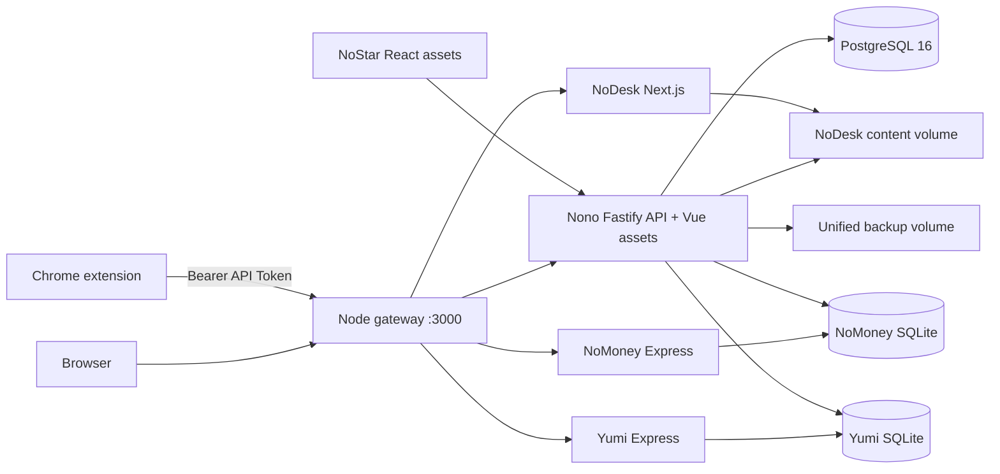

# Nono

<p align="center">
  <a href="README.md">简体中文</a> | <strong>English</strong>
</p>

<p align="center">
  
</p>

<p align="center">
  A self-hosted personal workspace for bookmarks, publishing, personal finance, infrastructure, GitHub Stars, and web clipping.
</p>

<p align="center">
  <a href="https://github.com/noaul/nono">GitHub</a> ·
  <a href="https://github.com/noaul/nono/issues">Issues</a> ·
  <a href="https://noaul.com/privacy">Privacy Policy</a>
</p>

Nono is not a single-page application. It is a collection of personal services that share one repository, one origin, and one deployment pipeline. The core Nono service provides public navigation pages, administration, authentication, and APIs. NoDesk, NoMoney, Yumi, NoStar, and the Chrome extension cover publishing, expenses, infrastructure, GitHub Stars, and browser bookmark capture.

> Nono targets personal or small trusted-user self-hosting. The default production topology is one application container plus one PostgreSQL container, not a multi-node high-availability system.

## Table of Contents

- [Products](#products)
- [Feature Overview](#feature-overview)
- [Architecture](#architecture)
- [Technology](#technology)
- [Repository Layout](#repository-layout)
- [Quick Start](#quick-start)
- [First-Time Setup](#first-time-setup)
- [Local Development](#local-development)
- [Environment Variables](#environment-variables)
- [Data and Storage](#data-and-storage)
- [Authentication and Authorization](#authentication-and-authorization)
- [AI Integrations](#ai-integrations)
- [Testing and Quality Gates](#testing-and-quality-gates)
- [Production Deployment](#production-deployment)
- [Backup and Restore](#backup-and-restore)
- [Data Migration](#data-migration)
- [Chrome Extension](#chrome-extension)
- [Third-Party Dependencies](#third-party-dependencies)
- [Security and Privacy](#security-and-privacy)
- [Troubleshooting](#troubleshooting)
- [Maintenance Conventions](#maintenance-conventions)
- [Documentation Index](#documentation-index)
- [Project Links and License](#project-links-and-license)
- [Community](#community)

## Products

| Product | Default path | Purpose | Authentication | Primary storage |
| --- | --- | --- | --- | --- |
| **Nono** | `/`, `/:username`, `/admin/*` | Public navigation, bookmarks, folders, site settings, users, and system administration | Nono Session / Passkey / API Token | PostgreSQL |
| **NoDesk** | `/nodesk/*` | Articles, images, projects, links, snippets, schedules, and a personal content site | Public reads; Nono administrator Session for writes | `nodesk_content` volume |
| **NoMoney** | `/nomoney/*` | Phone cards, subscriptions, accounts, expenses, and expiry reminders | Independent HttpOnly cookie Session | `nomoney_data/app.db` |
| **Yumi** | `/yumi/*` | VPS and domain inventory, renewals, costs, and status | Independent HttpOnly cookie Session | `yumi_data/app.db` |
| **NoStar** | `/nostar/*` | GitHub Stars, categories, search, releases, AI analysis, and backup | Nono Session | PostgreSQL |
| **Chrome extension** | Popup / context menu / shortcuts | Extract the current page and save a bookmark | Scoped Bearer API Token | `chrome.storage.local` |

In production, `docker/gateway.mjs` listens on the external application port, routes requests, and manages the business subprocesses. If a critical subprocess exits, the application container exits so Docker Compose can restart it.

## Feature Overview

### Nono

- Public navigation pages for each user, with configurable branding, search engines, themes, backgrounds, and display options.
- Tree-structured folders and bookmarks with sorting, moving, bulk actions, duplicate detection, import/export, and trash.
- Visitor access controls, site passwords, and per-folder passwords.
- Automatic page metadata and favicon retrieval, scheduled link health checks, and final redirect URL updates.
- Notab, notifications, user administration, appearance settings, automation, audit logs, and backup management.
- Password login, Passkeys, device Session management, and scoped, expiring API Tokens.
- OpenAI-compatible and Claude-compatible page analysis for bookmark names, descriptions, and folder suggestions.
- Chinese and English interfaces with responsive desktop and mobile layouts.

### NoDesk

- Home workspace, article lists and detail pages, about, projects, images, links, authors, and snippets.
- Markdown, syntax highlighting, KaTeX, table of contents, RSS, Sitemap, and site metadata.
- Writing, image upload, site configuration, and home-layout editing.
- Same-origin Nono administrator Session for write operations; no separate browser-side write secret.
- Content, images, site configuration, and schedules persist in a dedicated volume.

### NoMoney

- Phone card, subscription, and account management.
- Actual expense history plus projected monthly and annual costs.
- Asset counts, due items, cost trends, and reminder status.
- CNY, USD, GBP, and EUR displayed independently without automatic currency conversion.
- Daily due-date scans, SMTP email reminders, trash, and encrypted JSON backups.
- Independent account, Session, encryption key, and SQLite database.

### Yumi

- VPS and domain inventory with providers, regions, specifications, billing cycles, expiry dates, and renewals.
- Renewal records linked to actual expenses and upcoming-expiry notifications in Nono.
- Scheduled VPS status collection with availability, capacity, and history.
- Encrypted infrastructure credentials, explicit private outbound host allowlists, and encrypted JSON backups.
- Shared code and components with NoMoney, but separate processes, accounts, cookies, keys, and SQLite files.

### NoStar

- Integrated and evolved from [AmintaCCCP/GithubStarsManager](https://github.com/AmintaCCCP/GithubStarsManager).
- GitHub Stars synchronization, categories, custom tags, descriptions, ordering, and bulk actions.
- Local search and filtering, README viewing, related repositories, and discovery.
- Release tracking, unread state, and downloadable assets.
- OpenAI-compatible and Claude-compatible profiles, repository analysis, automatic classification, embeddings, and external vector search.
- GitHub, AI, WebDAV, proxy, aria2 RPC, and diagnostic settings.
- Per-user PostgreSQL isolation; GitHub Tokens, AI keys, WebDAV passwords, and other secrets are encrypted server-side.

### Chrome Extension

- Reads the active tab only after an explicit user action.
- Bookmark analysis with confirmation, manual folder selection, and quick save to the most recent folder.
- Duplicate URL handling that can update an existing bookmark or save another copy.
- Toolbar popup, context menus, and `Alt+Shift+S` and `Alt+Shift+B` shortcuts.
- Requests access only to the exact configured Nono origin and does not register a persistent content script.
- Chinese and English UI with connection testing, Token expiry status, and direct project links.

## Architecture



### Request Routing

| External path | Target | Notes |
| --- | --- | --- |
| `/`, `/:username` | Nono | Default or named public navigation page |
| `/login`, `/setup`, `/admin/*` | Nono | Login, bootstrap, and administration |
| `/api/*` | Nono | Nono API, including NoStar APIs |
| `/nodesk`, `/nodesk/*` | NoDesk | Content site and editor |
| `/blog/*` | NoDesk | Compatibility route; redirects to `/nodesk/*` |
| `/nomoney`, `/nomoney/*` | NoMoney | Personal finance workspace |
| `/yumi`, `/yumi/*` | Yumi | VPS and domain workspace |
| `/nostar`, `/nostar/*` | Nono / NoStar | NoStar assets and same-origin APIs |
| `/healthz`, `/livez` | Nono | Process liveness |
| `/readyz` | Nono | PostgreSQL, NoDesk content, NoMoney, and Yumi readiness |

`GATEWAY_TRUST_FORWARDED_HEADERS` is disabled by default. When enabled, `GATEWAY_TRUSTED_PROXY_ADDRESSES` must identify the proxy IPs or CIDRs allowed to provide forwarded headers.

## Technology

| Layer | Technology |
| --- | --- |
| Nono API | Node.js 22, TypeScript, Fastify 5, Prisma 6, PostgreSQL 16, Zod |
| Nono Web | Vue 3, Vite 7, Pinia, Vue Router, SortableJS, Lucide |
| NoDesk | Next.js 16, React 19, Markdown/Unified, KaTeX, Shiki, Zustand |
| NoMoney / Yumi | Express 4, React 18, Vite 6, sql.js/SQLite, Recharts, JWT cookies |
| NoStar | React 18, Vite 8, Zustand, Tailwind CSS |
| Chrome extension | Manifest V3, JavaScript, Chrome Extension APIs |
| Testing | Vitest, Node test runner, Playwright, contract tests |
| Deployment | Multi-stage Dockerfile, Docker Compose, Node HTTP gateway |

The root npm workspaces contain only `packages/server`, `packages/web`, and `packages/extension`. NoDesk, NoMoney, and NoStar keep independent package managers or lockfiles under `apps/`.

## Repository Layout

```text
nono/
|- packages/
|  |- server/          # Nono, NoStar APIs, Prisma, auth, backup, jobs
|  |- web/             # Nono Vue frontend
|  `- extension/       # Chrome extension, store assets, release docs
|- apps/
|  |- blog/            # NoDesk Next.js content site
|  |- nomoney/         # Shared NoMoney/Yumi Express and React sources
|  `- nostar/          # NoStar React frontend
|- docker/             # Single-port gateway and forwarded-header rules
|- scripts/            # Deploy, acceptance, rollback, backup, restore, migration
|- tests/              # Cross-module, Docker, gateway, and deployment contracts
|- docs/
|  |- deployment/      # Production, backup, restore, migration, audit runbooks
|  |- design/          # Shared UI contracts and theme documentation
|  `- quality/         # UI and performance acceptance baselines
|- design/              # Brand icons and design assets
|- Dockerfile
|- docker-compose.yml
|- .env.example
`- package.json        # Repository-wide command entry point
```

## Quick Start

### Full Stack with Docker Compose

```bash
git clone https://github.com/noaul/nono.git
cd nono
cp .env.example .env
```

On Windows PowerShell, use `Copy-Item .env.example .env`. Replace every `replace-with-*` value and review at least:

- `POSTGRES_PASSWORD`
- `SESSION_SECRET`, at least 32 characters
- `ENCRYPTION_KEY`, 64 hexadecimal characters
- Independent `NOMONEY_JWT_SECRET` and `YUMI_JWT_SECRET`
- `NOMONEY_INTERNAL_TOKEN`
- Preferably independent `NOMONEY_ENCRYPTION_KEY` and `YUMI_ENCRYPTION_KEY`
- `NONO_PUBLIC_URL` and `BLOG_PUBLIC_URL`

For local HTTP testing, set `NONO_PUBLIC_URL=http://localhost:3000` and temporarily set `NOMONEY_COOKIE_SECURE=false` and `YUMI_COOKIE_SECURE=false`. Production must use HTTPS and secure cookies.

```bash
docker compose up -d --build
docker compose ps
curl --fail http://127.0.0.1:3000/healthz
curl --fail http://127.0.0.1:3000/readyz
```

Default pages:

| Page | URL |
| --- | --- |
| Nono | `http://localhost:3000/` |
| Nono administration | `http://localhost:3000/admin/` |
| NoDesk | `http://localhost:3000/nodesk/` |
| NoMoney | `http://localhost:3000/nomoney/` |
| Yumi | `http://localhost:3000/yumi/` |
| NoStar | `http://localhost:3000/nostar/` |

Use `docker compose down` to stop the stack. Do not add `-v` during routine stops or upgrades because it deletes persistent volumes.

### Nono-Only Development

```bash
npm run install:all
cp .env.example .env
docker compose up -d postgres
npm run prisma:generate
npm run prisma:migrate
```

Start the API and frontend separately:

```bash
npm run dev
npm run dev:web
```

- API: `http://127.0.0.1:3000`
- Vite frontend: `http://127.0.0.1:5173`
- Vite proxies `/api` to `VITE_API_TARGET`, which defaults to `http://127.0.0.1:3000`.

## First-Time Setup

### Nono

The first browser visit redirects to `/setup`. The first administrator can be created only with the shared `BOOTSTRAP_TOKEN`. PostgreSQL locking and `AppConfig.initializedAt` prevent concurrent initialization.

After setup:

1. Confirm email, password, and Passkeys in account settings.
2. Configure the public navigation page.
3. Create folders and bookmarks or import a browser bookmark file.
4. Create a dedicated expiring API Token for each extension or automation.
5. Add and test an LLM provider only if AI analysis is needed.

With `ALLOW_REGISTRATION=false`, later self-registration is disabled. Administrators can change registration and user roles from the administration interface. Self-registration always creates a regular user.

### NoMoney and Yumi

NoMoney and Yumi each have an independent `/setup` and use the same `BOOTSTRAP_TOKEN` to create their separate accounts. They do not reuse the Nono Session or each other's cookies. A fresh production Yumi database waits for NoMoney during the one-time split of legacy VPS and domain data.

### NoDesk and NoStar

NoDesk content is public; editing requires a Nono administrator Session. NoStar reuses the Nono Session and redirect unauthenticated users to the Nono login page with the original destination preserved.

## Local Development

Requirements:

- Node.js `>=22`
- npm `>=10`
- pnpm `11.8.0`, pinned by NoDesk
- PostgreSQL 16
- Docker Engine and Docker Compose v2 for container development and deployment

```bash
corepack enable
npm run install:all
```

`install:all` uses four lockfile groups: the root npm workspace, NoDesk pnpm, NoMoney npm, NoStar npm.

| Target | Command | Notes |
| --- | --- | --- |
| Nono API | `npm run dev` | Fastify watch mode, port 3000 |
| Nono Web | `npm run dev:web` | Vite, port 5173 |
| NoDesk | `npm run dev:blog` | Next.js Turbopack, port 2025 |
| NoMoney backend | `npm run dev:nomoney` | Shared backend in NoMoney mode, port 3000 |
| NoStar frontend | `npm run dev:nostar` | Vite development server |
| All production builds | `npm run build:all` | Builds every product and the extension |

Several independent development servers use the same default ports. Run only the target currently under development or configure separate ports. Use Compose for same-origin authentication, routing, and integration tests.

NoMoney and Yumi share frontend sources. `npm run build:nomoney` writes:

- `apps/nomoney/backend/public/` for NoMoney
- `apps/nomoney/backend/public-yumi/` for Yumi

Database commands:

```bash
npm run prisma:generate
npm run prisma:migrate
npm run prisma:deploy
npm run seed
```

`npm run seed` is not part of first-time setup and requires `SEED_ADMIN_PASSWORD`. Do not run it casually against shared or production databases.

## Environment Variables

Use [`.env.example`](.env.example) as the starting point. Do not commit `.env`. Production secrets should come from a password manager, container secret, or controlled deployment system.

`docker-compose.yml` passes only variables explicitly mapped under `app.environment`. Variables supported by a directly started Nono server but not mapped there, such as `CORS_ORIGIN` or `LOG_LEVEL`, must also be added to the Compose environment when overridden in a container.

### PostgreSQL and Nono

| Variable | Default or requirement | Purpose |
| --- | --- | --- |
| `POSTGRES_DB` | `nono` | Compose database |
| `POSTGRES_USER` | `nono` | Compose database role |
| `POSTGRES_PASSWORD` | Required in production | PostgreSQL password |
| `POSTGRES_BIND_ADDRESS` | `127.0.0.1` | Host bind address |
| `POSTGRES_PORT` | `5433` | Host database port |
| `DATABASE_URL` | Required locally; generated by Compose | Prisma connection string |
| `SESSION_SECRET` | Required, at least 32 characters | Nono Session signing |
| `ENCRYPTION_KEY` | Required, 64 hexadecimal characters | Server-side integration secret encryption |
| `ALLOW_REGISTRATION` | `false` | Initial self-registration setting |
| `CORS_ORIGIN` | Empty | Additional allowed browser origins |
| `LOG_LEVEL` | `info` | Nono log level |

### URLs, Gateway, and WebAuthn

| Variable | Default or requirement | Purpose |
| --- | --- | --- |
| `PORT` | `127.0.0.1:3000` | Compose application port mapping |
| `BOOTSTRAP_TOKEN` | Required in production | Shared one-time setup credential |
| `NONO_PUBLIC_URL` | Required in production | Browser-visible root URL and origin checks |
| `BLOG_PUBLIC_URL` | Required in production | Full NoDesk URL, normally `<root>/nodesk` |
| `NONO_NAVIGATION_URL` | `/` | NoDesk link back to Nono |
| `BLOG_NAVIGATION_URL` | `/nodesk` | Nono link to NoDesk |
| `WEBAUTHN_RP_NAME` | `Nono` | Passkey display name |
| `WEBAUTHN_RP_ID` | Derived from public URL | Optional RP ID override |
| `WEBAUTHN_ORIGIN` | Derived from public URL | Optional exact origin override |
| `GATEWAY_TRUST_FORWARDED_HEADERS` | `false` | Trust forwarded headers |
| `GATEWAY_TRUSTED_PROXY_ADDRESSES` | Empty | Allowed proxy IPs or CIDRs |
| `GATEWAY_UPSTREAM_TIMEOUT_MS` | `30000` | Internal upstream timeout |
| `NONO_BUILD_COMMIT` | `unknown` | Build identifier recorded in backup manifests |
| `TZ` | `Asia/Shanghai` | Schedule, reminder, and backup timezone |

### Outbound Access and Jobs

| Variable | Default | Purpose |
| --- | --- | --- |
| `PRIVATE_OUTBOUND_HOSTS` | Empty | Exact private hosts allowed through SSRF protection |
| `LINK_HEALTH_CHECK_ENABLED` | `true` | Scheduled link checking |
| `LINK_HEALTH_CHECK_INTERVAL_HOURS` | `24` | Link result freshness period |
| `LINK_HEALTH_CHECK_START_DELAY_SECONDS` | `60` | Link-check scheduler delay |
| `BACKUP_AUTOMATION_POLL_SECONDS` | `60` | Backup plan polling interval |
| `BACKUP_AUTOMATION_START_DELAY_SECONDS` | `60` | Backup scheduler startup delay |

`PRIVATE_OUTBOUND_HOSTS` weakens the default SSRF boundary. Add only exact hosts or IP addresses that you control.

### NoMoney and Yumi

| Variable | Default or requirement | Purpose |
| --- | --- | --- |
| `NOMONEY_JWT_SECRET` | Required | Independent NoMoney Session key |
| `YUMI_JWT_SECRET` | Required | Independent Yumi Session key |
| `NOMONEY_INTERNAL_TOKEN` | Required | Protected Nono/Yumi renewal calls |
| `NOMONEY_ENCRYPTION_KEY` | Falls back to `ENCRYPTION_KEY` | NoMoney sensitive fields |
| `YUMI_ENCRYPTION_KEY` | Required by Compose | Yumi sensitive fields |
| `NOMONEY_COOKIE_SECURE` | `true` | HTTPS-only NoMoney cookie |
| `YUMI_COOKIE_SECURE` | `true` | HTTPS-only Yumi cookie |
| `NOMONEY_SMTP_*` | Empty except port `587` | Optional reminder email configuration |

Changing encryption keys makes existing encrypted fields unreadable. Changing Session or JWT secrets invalidates current Sessions. Editing `POSTGRES_PASSWORD` in `.env` does not change the password stored in an existing PostgreSQL volume.

## Data and Storage

| Compose volume | Contents | Primary readers and writers |
| --- | --- | --- |
| `nono_pg_data` | Nono, NoStar, users, Sessions, Passkeys, audit, settings | PostgreSQL |
| `nodesk_content` | NoDesk articles, images, site settings, schedules | Nono and NoDesk |
| `nomoney_data` | NoMoney `app.db` | NoMoney; Nono reads due information |
| `yumi_data` | Yumi `app.db`, VPS status, renewals | Yumi; Nono reads notifications and calls protected APIs |
| `nono_backups` | Full-stack `.tar.gz` archives and JSON manifests | Nono and maintenance scripts |

NoMoney and Yumi persist SQLite files through `sql.js`. Do not run multiple writers against either SQLite volume.

- Deleted Nono folders and bookmarks enter trash before permanent deletion.
- Session and API Token plaintext is shown only at creation; only hashes are stored.
- Integration credentials remain sensitive even when encrypted in a backup.
- A fresh NoDesk content volume is initialized from image seed content; upgrades do not overwrite initialized content.
- Unified backups do not include `.env`, TLS certificates, or reverse-proxy configuration.

## Authentication and Authorization

| Scenario | Authentication | Boundary |
| --- | --- | --- |
| Nono browser | `nono_session` HttpOnly cookie | User resource isolation; administrators manage system resources |
| Passkey | WebAuthn | Bound to HTTPS origin and RP ID |
| Extension / automation | `Authorization: Bearer <token>` | Token scopes and expiry |
| NoDesk editing | Nono administrator Session | Public reads, administrator writes |
| NoStar | Nono Session | Per-user PostgreSQL data |
| NoMoney | Independent HttpOnly JWT cookie | NoMoney SQLite only |
| Yumi | Independent HttpOnly JWT cookie | Yumi SQLite only |
| Nono to Yumi | `NOMONEY_INTERNAL_TOKEN` | Protected renewal operations only |

API Token scopes:

| Scope | Capability |
| --- | --- |
| `bookmarks:read` | Read folders and bookmarks |
| `bookmarks:write` | Create, update, move, and delete bookmarks |
| `ai:analyze` | Call bookmark analysis |
| `*` | Full API Token authority |

New extension Tokens default to bookmarks:read, bookmarks:write, and ai:analyze. Clipping is retired; the upgrade removes historical clipping data and scopes. Create one Token per device, set an expiry, and revoke it when a device is lost or retired.

Passkeys require HTTPS or a browser-recognized localhost secure context. Changing the domain or RP ID invalidates existing Passkeys for that origin, so retain a recoverable password login during migration.

## AI Integrations

Nono supports:

- OpenAI-compatible APIs, default base URL `https://api.openai.com/v1`, using `chat/completions`.
- Claude-compatible APIs, default base URL `https://api.anthropic.com/v1`, using `messages`.

Each user can configure provider, base URL, API key, model, and reasoning effort. NoStar additionally supports multiple AI profiles, embedding settings, and external vector search.

Bookmark analysis sends the page URL, title, a truncated text summary, and folder rules to the configured model. If no model is configured or the request fails, local fallback logic keeps basic bookmarking available.

Server-side LLM and integration requests resolve DNS before connection, reject loopback/private/link-local/cloud-metadata targets by default, revalidate redirects, and enforce timeouts and response limits. Private compatible services must be explicitly added to `PRIVATE_OUTBOUND_HOSTS`.

## Testing and Quality Gates

Run the complete verification pipeline:

```bash
npm run verify:all
```

It runs:

1. Nono Server, Web, extension, NoDesk, NoMoney, NoStar, and gateway/deployment tests.
2. NoDesk and NoStar type checks, plus NoStar ESLint.
3. All production builds.
4. Playwright end-to-end tests.
5. NoStar bundle budget.
6. High-severity audits for the root workspace, NoDesk, NoMoney, NoStar.
7. Chrome extension packaging and artifact validation.

Focused commands:

```bash
npm test
npm run test:blog
npm run test:nomoney
npm run test:nostar
npm run test:gateway
npm run test:e2e
npm run build:all
npm run audit:all
npm run package:extension
```

Install Playwright Chromium before the first end-to-end run:

```bash
npm run test:e2e:install
```

GitHub Actions runs remote quality gates for pull requests and pushes to `main`. Production deployment remains an explicit server-side Compose operation.

## Production Deployment

1. Install Docker Engine, Docker Compose v2, and Git on a Linux host.
2. Place the repository in a controlled directory such as `/opt/nono`.
3. Create `.env` from `.env.example` with independent random secrets and real HTTPS URLs.
4. Bind the application and database ports to loopback and terminate public TLS at a reverse proxy.

```bash
cd /opt/nono
docker compose up -d --build
docker compose ps
curl --fail http://127.0.0.1:3000/readyz
```

After PostgreSQL becomes healthy, the application container initializes volume ownership, runs `prisma migrate deploy`, and starts the gateway plus Nono, NoDesk, NoMoney, and Yumi processes.

Acceptance-based deployment:

```bash
flock -n /var/lock/nono-deploy.lock node scripts/deploy-compose.mjs --dir /opt/nono --base-url http://127.0.0.1:8188
npm run deploy:accept -- --base-url http://127.0.0.1:8188
npm run deploy:rollback -- --dir /opt/nono --base-url http://127.0.0.1:8188 --image nono-app:<git-commit>
```

Use the loopback URL matching `PORT`. Deployment checks pending migrations against the live database and requires explicit `--allow-destructive-migrations` for destructive changes. It builds first, stops all app writers, then creates and verifies a complete snapshot using the old immutable image. Safety archives live in `/app/backups/deployment-safety`, outside ordinary retention. The candidate passes acceptance on an isolated port and again on the normal port under maintenance before ingress is released. Failure before release restores the snapshot and old image; an uncertain release never rolls back accepted data.

Serialize deployment and restore operations with the same `flock` lock. The standalone `deploy:rollback` command only switches images, not database or volume data, and cannot alone reverse an incompatible migration. See the [deployment runbook](docs/deployment/compose-verified-deploy.md).

Minimal Nginx forwarding:

```nginx
server {
    listen 443 ssl;
    server_name example.com;

    location / {
        proxy_pass http://127.0.0.1:3000;
        proxy_http_version 1.1;
        proxy_set_header Host $host;
        proxy_set_header X-Real-IP $remote_addr;
        proxy_set_header X-Forwarded-For $proxy_add_x_forwarded_for;
        proxy_set_header X-Forwarded-Proto https;
    }
}
```

Set public URLs and secure cookies:

```text
NONO_PUBLIC_URL=https://example.com
BLOG_PUBLIC_URL=https://example.com/nodesk
NOMONEY_COOKIE_SECURE=true
YUMI_COOKIE_SECURE=true
```

Do not expose PostgreSQL or the unencrypted application port publicly. Enable forwarded-header trust only when the reverse proxy is the sole entry point and its address is allowlisted.

## Backup and Restore

Unified backups cover PostgreSQL, NoDesk files, NoMoney SQLite, and Yumi SQLite. PostgreSQL includes Nono, NoStar, users, Passkeys, Sessions, and encrypted integration settings. Each backup creates a `.tar.gz` archive and a JSON manifest with build identity, sizes, and SHA-256 checksums.

```bash
npm run backup:create
npm run backup:list
npm run backup:verify -- --id <backup-id>
npm run backup:drill -- --id <backup-id>
```

`backup:drill` restores into a temporary PostgreSQL database and temporary directories without modifying production data.

Restore overwrites production data and requires the backup ID twice:

```bash
npm run backup:restore -- --id <backup-id> --confirm <backup-id>
```

The restore process validates paths, checksums, PostgreSQL TOC, and SQLite integrity; stops all app writers; creates and verifies an offline safety snapshot; restores all components; and accepts the original immutable image under maintenance before releasing ingress. Failure before release restores the safety snapshot. Restoring pre-retirement clipping data requires the matching old image, or the new image will apply the retirement migration again.

NoDesk per-account module backup and restore use persisted background jobs with immediate acceptance and status polling. Network failure does not imply operation failure; check the original job before retrying. Full-stack disaster recovery remains a server-side operation. The legacy `POST /api/admin/backups` endpoint remains synchronous and is not used by the new UI.

Important boundaries:

- Backup archives are not additionally encrypted.
- A backup volume on the same host does not protect against full-host or disk failure.
- Copy archives to controlled off-host storage and encrypt them in transit and at rest.
- Cross-host restore requires the original `ENCRYPTION_KEY`, `NOMONEY_ENCRYPTION_KEY`, and `YUMI_ENCRYPTION_KEY`.
- `.env`, TLS certificates, and reverse-proxy configuration must be backed up separately.

See [Full Backup and Restore](docs/deployment/full-backup-restore.md) for the complete runbook.

## Data Migration

Prisma development and production commands:

```bash
npm run prisma:migrate
npm run prisma:deploy
```

Legacy Nono JSON:

```bash
npm run migrate:json -- data/nono.json
```

Provide `MIGRATED_ADMIN_PASSWORD` through a controlled process environment. Do not put real passwords in shell history, logs, or repository files.

Legacy NoStar SQLite:

```bash
npm run migrate:nostar -- --sqlite /path/to/data.db --username admin --dry-run
npm run migrate:nostar -- --sqlite /path/to/data.db --username admin
```

The migration reads a sibling `.encryption-key` or accepts `--source-key <64-hex>`, creates a timestamped backup before a real migration, and uses idempotent upserts.

NoMoney and Yumi production migration must follow:

- [NoMoney production migration](docs/deployment/nomoney-production-migration.md)
- [Yumi data split](docs/deployment/yumi-split-migration.md)

Always back up, verify, rehearse on a copy, record the rollback point, and only then switch production.

## Chrome Extension

The extension is under `packages/extension`; the current version is **0.4.2**.

```bash
npm ci
npm run build -w packages/extension
```

Open `chrome://extensions/`, enable Developer mode, load `packages/extension/dist/`, create a dedicated Nono API Token, and configure the exact Nono origin. Public origins must use HTTPS; HTTP is accepted only for localhost development.

| Permission | Purpose |
| --- | --- |
| `activeTab` | Read the active tab after an explicit user action |
| `scripting` | Inject packaged extraction code on demand |
| `storage` | Store origin, Token, language, and recent folder |
| `contextMenus` | Bookmark and clipping context-menu commands |
| Optional host permission | Access only the configured Nono origin |

Package a release:

```bash
npm run package:extension
```

Outputs:

```text
packages/extension/dist/
packages/extension/artifacts/nono-quick-bookmark-chrome-v0.4.2/
packages/extension/artifacts/nono-quick-bookmark-chrome-v0.4.2.zip
```

Before release, synchronize `packages/extension/package.json` and `manifest.json`, run extension tests and packaging, and confirm the ZIP contains no secrets, source maps, tests, temporary files, or personal data.

- [Extension usage and permissions](packages/extension/README.md)
- [Chrome Web Store submission](packages/extension/CHROME_WEB_STORE.md)
- [Store asset guide](packages/extension/store-assets/README.md)

## Third-Party Dependencies

Third-party notices are recorded in [THIRD_PARTY_NOTICES.md](THIRD_PARTY_NOTICES.md). This notice file does not grant a repository-wide license. The repository currently has no root `LICENSE`, so all rights are reserved unless a component states otherwise.

## Security and Privacy

Implemented controls include:

- Password strength checks and slow password hashing; only Session and API Token hashes are persisted.
- `HttpOnly`, `SameSite=Lax`, and production `Secure` Session cookies.
- Identity, role, ownership, origin, and cross-site context checks on authenticated writes.
- Helmet and CSP restrictions on scripts, objects, and framing.
- Tiered rate and body-size limits on login, registration, setup, AI, and backup endpoints.
- Redacted audit logs for authenticated writes.
- DNS- and redirect-aware SSRF protection for LLM, link checks, WebDAV, proxy, and refetch requests.
- Path normalization, temporary writes, and atomic replacement for NoDesk content.
- Backup ID, archive path, checksum, PostgreSQL TOC, and SQLite integrity validation.
- Non-root application processes inside the container after volume initialization.
- On-demand extension access scoped to the exact configured service origin.

Operators remain responsible for:

- TLS at the public edge and network restrictions on database and management ports.
- Independent random secrets for PostgreSQL, Nono, NoMoney, Yumi, and internal calls.
- Access controls for `.env`, backups, logs, and the Docker socket.
- Dependency updates, `npm run audit:all`, Token rotation, and Session cleanup.
- Encrypted off-host backups and periodic full restore drills.
- Reviewing third-party AI, SMTP, GitHub, WebDAV, and proxy data policies.

Never commit secrets, cookies, certificates, database dumps, production logs, real user data, or screenshots containing personal or infrastructure details. If a credential enters Git history, revoke or rotate it before cleaning the history.

Do not post live credentials, user data, or directly exploitable details in a public Issue. Revoke affected Tokens or Sessions, preserve redacted evidence, and use a private maintainer channel when available.

## Troubleshooting

### Compose reports missing variables

Create `.env` from `.env.example` and replace all placeholders. Compose or the application rejects missing PostgreSQL, encryption, public URL, JWT, internal-token, and Yumi encryption values.

### NoMoney or Yumi returns to login on local HTTP

Temporarily set:

```text
NOMONEY_COOKIE_SECURE=false
YUMI_COOKIE_SECURE=false
```

Never disable secure cookies in production.

### `/readyz` returns 503

`/healthz` proves only that the Nono process is alive. `/readyz` also checks PostgreSQL, NoDesk content, NoMoney, and Yumi.

```bash
curl http://127.0.0.1:3000/readyz
docker compose ps
docker compose logs --tail=200 app postgres
```

### Passkey registration or login fails

Confirm HTTPS or localhost, ensure `NONO_PUBLIC_URL` and `WEBAUTHN_ORIGIN` match the browser scheme, host, and port, and ensure `WEBAUTHN_RP_ID` matches the domain.

### PostgreSQL fails after changing its password

Changing `.env` does not change the role password inside an existing volume. Update PostgreSQL first, then update every connection string and deployment secret.

### The extension cannot connect

Check the exact origin, HTTPS, optional host permission, Token expiry, and required `bookmarks:read`, `bookmarks:write`, `ai:analyze` scopes.

### AI analysis always returns fallback results

Check provider, base URL, model, API key, and the administration connection test. Add an internal compatible service to the exact private-host allowlist when required.

### Fresh Yumi startup waits for a long time

A new Yumi volume waits for NoMoney during the legacy VPS/domain split. Check the NoMoney process, `nomoney_data` volume, and application logs.

### Development ports conflict

The Nono API and NoMoney backend both default to port 3000, and several Vite applications may use port 5173. Start only the current target, configure separate ports, or use Compose for integrated work.

## Maintenance Conventions

- Keep `main` deployable and add regression tests for behavior changes.
- Include Prisma migrations for schema changes and verify forward migration, restore, and image rollback boundaries.
- Preserve the root npm, NoDesk pnpm, NoMoney npm, NoStar npm lockfiles independently.
- Keep shared UI rules under `docs/design`.
- Commit source, migrations, stable documentation, quality baselines, and intentional release assets only.
- Do not commit temporary plans, output, screenshots, database copies, unpacked extension artifacts, or local diagnostics.
- Keep transient CI results and server state out of README files.
- Use object storage, Git LFS, or GitHub Releases for large binary assets.

Recommended pre-commit checks:

```bash
git diff --check
npm run verify:all
git status --short
```

## Documentation Index

### Deployment and Operations

- [Compose acceptance and rollback](docs/deployment/compose-verified-deploy.md)
- [Full backup and restore](docs/deployment/full-backup-restore.md)
- [NoMoney production migration](docs/deployment/nomoney-production-migration.md)
- [Yumi data split](docs/deployment/yumi-split-migration.md)
- [Audit logging](docs/deployment/audit-logs.md)

### Design and Quality

- [Shared UI contract](docs/design/ui-contract.md)
- [Appearance model](docs/design/appearance-settings.md)
- [Theme assets](docs/design/theme-assets.md)
- [UI performance baseline](docs/quality/ui-performance-baseline.md)

### Subprojects

- [Chrome extension](packages/extension/README.md)
- [Chrome Web Store submission](packages/extension/CHROME_WEB_STORE.md)
- [NoMoney](apps/nomoney/README.md)
- [NoStar](apps/nostar/README.md)

## Project Links and License

- Repository: [github.com/noaul/nono](https://github.com/noaul/nono)
- Issues: [github.com/noaul/nono/issues](https://github.com/noaul/nono/issues)
- Privacy policy: [noaul.com/privacy](https://noaul.com/privacy)

The repository currently has no root-level license. Do not assume permission to copy, modify, or redistribute the entire repository without explicit authorization. Imported code under `apps/nostar` retains its MIT license; see [NoStar LICENSE](apps/nostar/LICENSE).

## Community

Discussion and community: **[LINUX DO](https://linux.do/)**
